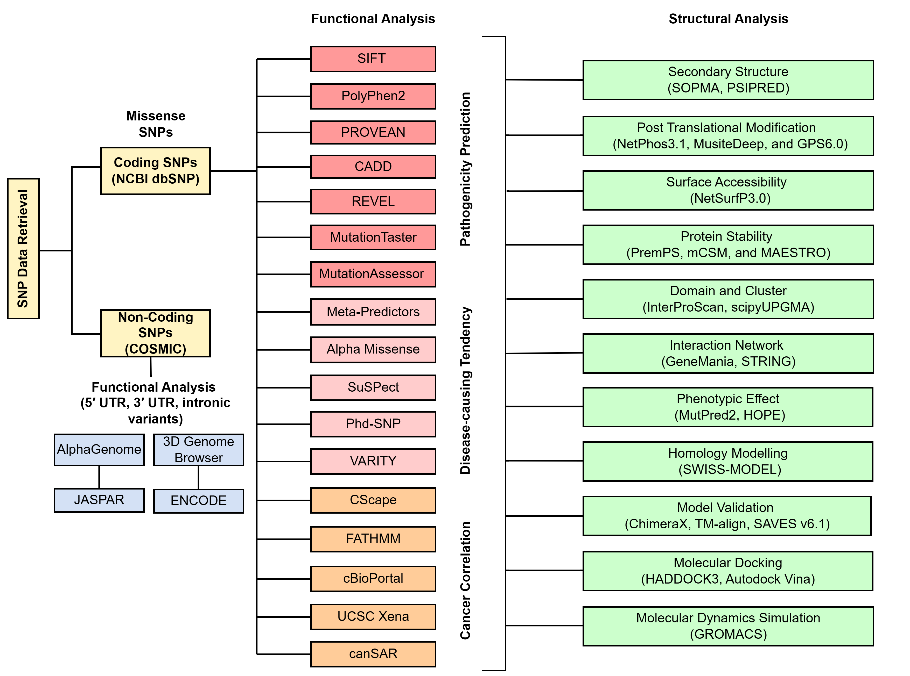
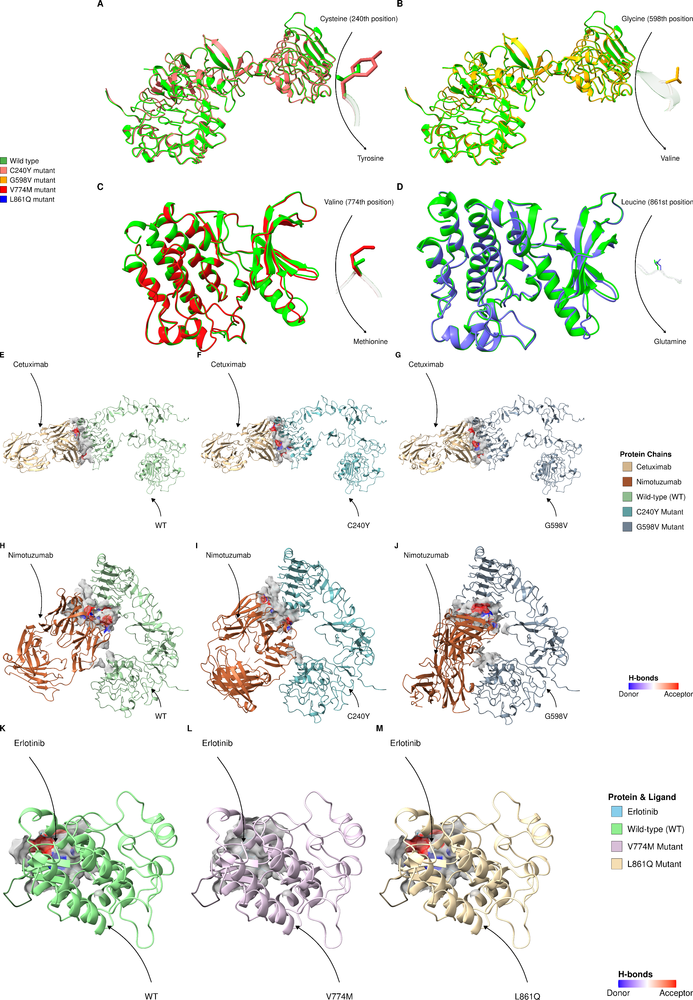
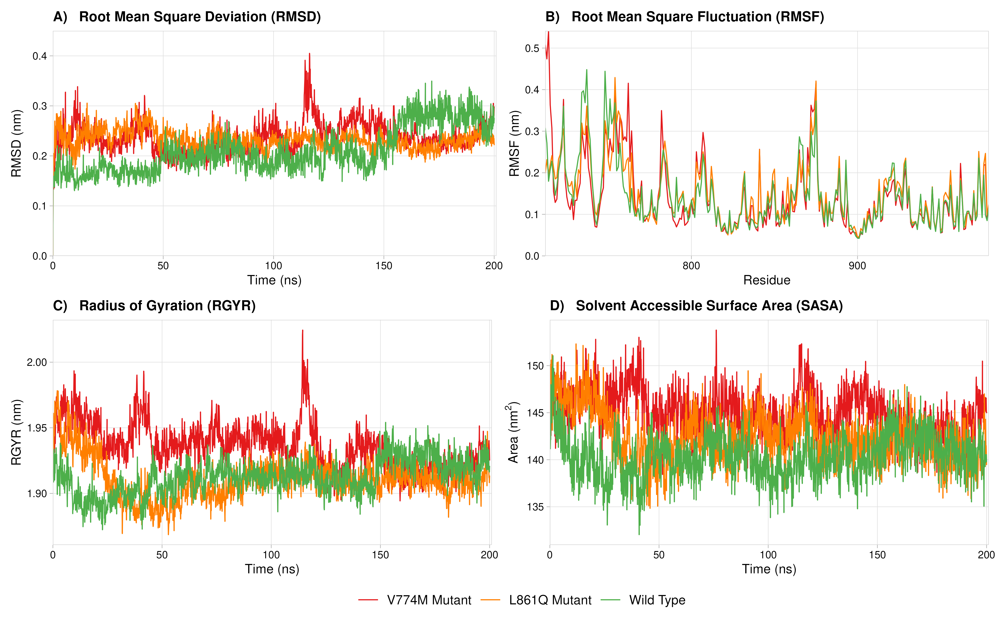
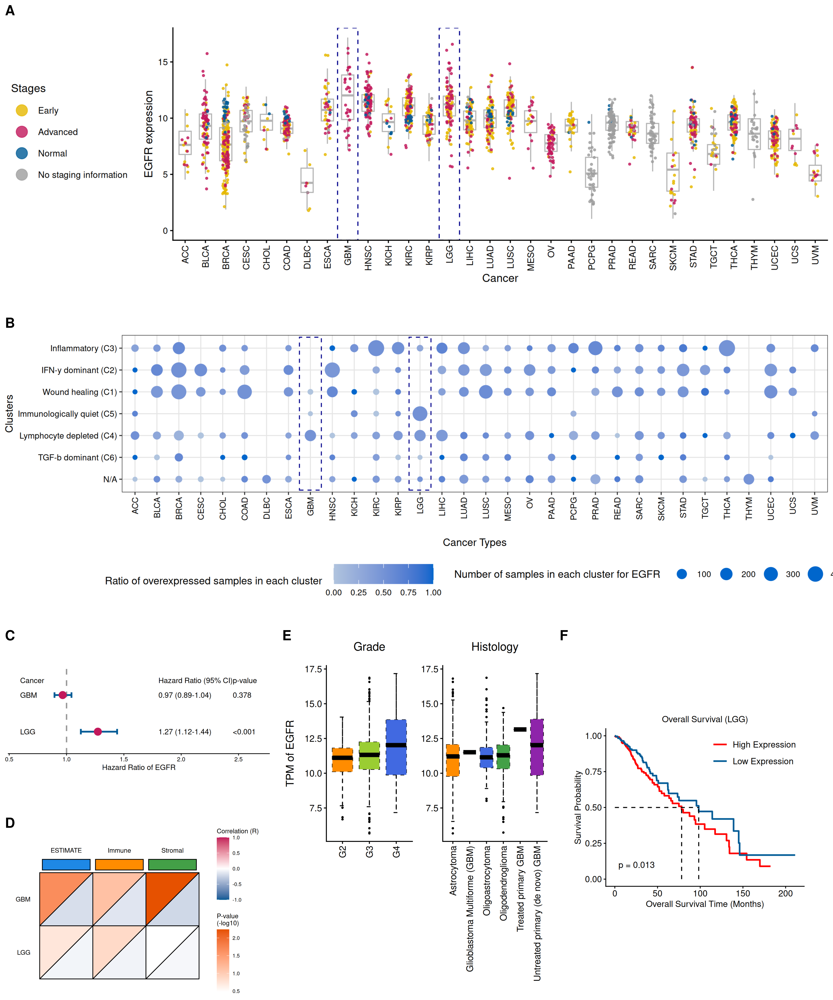
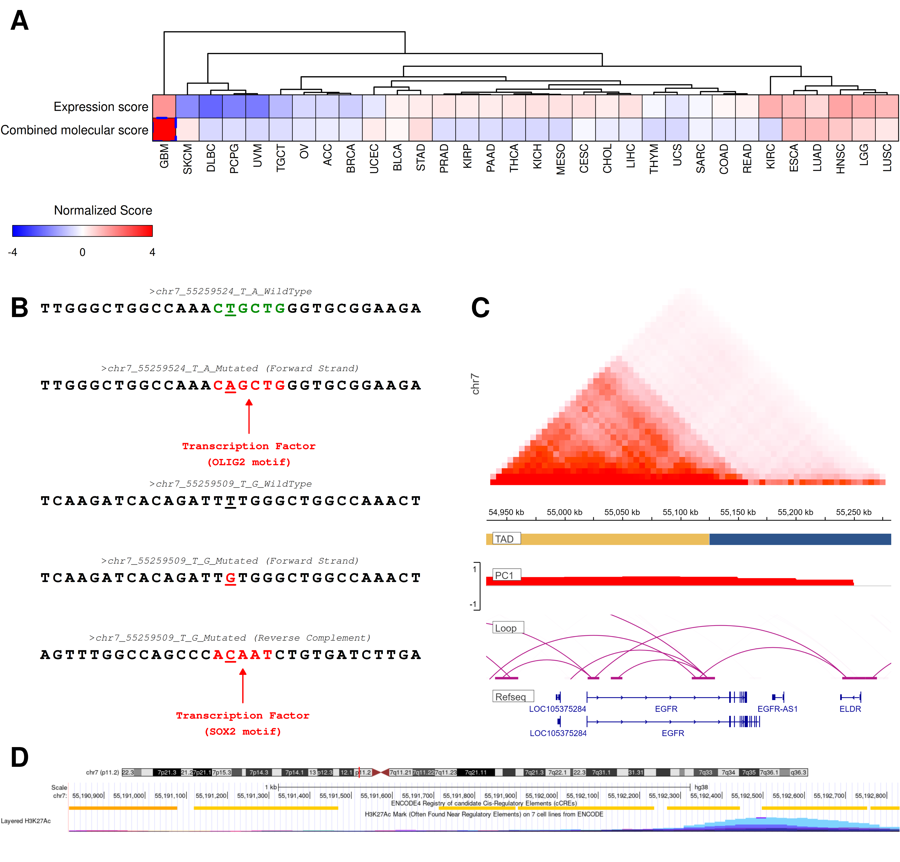

# EGFR-GBM: computational analysis of EGFR variants in glioblastoma

This repository contains the code used to examine coding and noncoding EGFR variants in glioblastoma. The analyses cover variant annotation and prioritization, protein structure, molecular docking and dynamics, regulatory predictions, and TCGA expression and clinical associations.



*Figure 1. Overview of the computational analyses.*

## Repository Structure

```text
EGFR-GBM/
|-- src/
|   |-- 01_data_preparation/
|   |-- 02_variant_prioritization/
|   |-- 03_structural_characterization/
|   |-- 04_docking/
|   |-- 05_molecular_dynamics/
|   |-- 06_clinical_analysis/
|   |-- 07_noncoding_analysis/
|   |-- 08_visualization/
|   `-- common/
|-- docker/                 # Dockerfile, Compose service, and dependencies
|-- data/                   # Local source data, references, and intermediate tables
|-- outputs/                # Local analysis results
|-- Figures/                # Manuscript figures
|-- Supplementary/          # Supplementary methods and tables
|-- LICENSE
`-- README.md
```

Scripts are numbered within each analysis folder. Prepared docking and molecular dynamics inputs are kept with their corresponding code. `data/` and `outputs/` are local working directories excluded from Git.

## Getting Started

Install Docker with the Docker Compose plugin. On Windows, use Docker Desktop with Linux containers enabled.

### 1. Clone the repository

```bash
git clone https://github.com/MrRajat1809/EGFR-GBM.git
cd EGFR-GBM
```

### 2. Start the environment

From the repository root:

```bash
docker compose -f docker/compose.yml up --build -d
docker compose -f docker/compose.yml logs -f egfr
```

Open **http://127.0.0.1:8888** and use the Jupyter token printed in the logs. The repository is mounted at `/project`; files saved there remain available on the host. JupyterLab provides Python and R kernels.

The [Dockerfile](docker/Dockerfile) defines a Linux x86-64 CPU environment with Python, R, GROMACS **2022.2**, AutoDock Vina, HADDOCK3, and the analysis libraries. Python dependency pins are stored in [requirements.tex](docker/requirements.tex), which is a pip requirements file despite its extension. R and system-tool versions are specified in the Dockerfile. The supplied configuration does not require NVIDIA GPU access.

To open a container terminal or stop the service:

```bash
docker compose -f docker/compose.yml exec egfr bash
docker compose -f docker/compose.yml down
```

### 3. Add data and model inputs

Obtain the resources listed below for the analyses you intend to use. The container installs software; reference databases, model weights, and exported prediction results are obtained separately.

AlphaGenome requires an individual API key from the access page linked in its [documentation](https://www.alphagenomedocs.com/). Set `ALPHAGENOME_API_KEY` in the host shell before starting the Compose service; the service passes it into the container. Keep the key outside scripts and version-controlled files. Enformer uses a local checkpoint and reference genome, described below.

## Source Data and Required Inputs

GRCh37 is the primary assembly for variant annotation. The Enformer and AlphaGenome inputs use GRCh38 coordinates. Retain the assembly associated with each file when obtaining annotations or preparing model inputs. Protein-level analyses use human EGFR, UniProt **P00533**, with canonical Ensembl protein **ENSP00000275493**.

### Variant and reference data

| Resource | Data to obtain | Local location |
| --- | --- | --- |
| [NCBI dbSNP](https://www.ncbi.nlm.nih.gov/snp/) | GRCh37 human variant VCF, `GCF_000001405.25.gz`, with its index. The collection used EGFR on `NC_000007.13`, positions 55086710–55279321. | EGFR subsets and annotated variant tables belong in `data/processed/variants/`. |
| [cBioPortal: TCGA GBM PanCancer Atlas](https://www.cbioportal.org/study/summary?id=gbm_tcga_pan_can_atlas_2018) | Download the study mutation data for `gbm_tcga_pan_can_atlas_2018`. | `data/raw/cbioportal/gbm_tcga_pan_can_atlas_2018/data_mutations.txt` |
| [COSMIC](https://cancer.sanger.ac.uk/cosmic/download) | **v103, GRCh37** noncoding variants and classification tables. Select the archived release and assembly in the download portal; access requires a COSMIC account. | `data/raw/noncoding/Cosmic_NonCodingVariants_v103_GRCh37.tsv.gz` and `Cosmic_Classification_v103_GRCh37.tsv.gz` |
| [dbNSFP](https://www.dbnsfp.org/download/) | **5.3.1a**, GRCh37 annotation file and tabix index. | `data/reference/dbnsfp_5.3.1a/dbNSFP5.3.1a_grch37.gz` and its `.tbi` |
| [Ensembl VEP](https://www.ensembl.org/info/docs/tools/vep/index.html) | GRCh37 annotations. The original collection used VEP 115.2, the human release-115 GRCh37 cache, and `Homo_sapiens.GRCh37.75.dna.primary_assembly.fa.gz`. | Cache under `data/reference/vep_cache_GRCh37/`; exported annotations under `data/processed/variants/`. |
| [UniProt EGFR](https://www.uniprot.org/uniprotkb/P00533/entry) and [Swiss-Prot](https://www.uniprot.org/help/downloads) | EGFR FASTA and the reviewed protein sequence database for sequence-based annotation. | `data/reference/uniprot/P00533.fasta` and `data/reference/swissprot/uniprot_sprot.fasta` |

### TCGA expression and clinical data

Obtain the following exports from [UCSC Xena](https://xenabrowser.net/datapages/), [ESTIMATE](https://bioinformatics.mdanderson.org/estimate/), and [cBioPortal](https://www.cbioportal.org/). Place them in `data/raw/clinical/` using the filenames below.

| File | Source and contents |
| --- | --- |
| `EB++AdjustPANCAN_IlluminaHiSeq_RNASeqV2.geneExp.xena.gz` | Xena TCGA Pan-Cancer gene expression matrix. |
| `Survival_SupplementalTable_S1_20171025_xena_sp` | Xena TCGA Pan-Cancer survival and clinical annotations. |
| `Subtype_Immune_Model_Based.txt.gz` | Xena immune subtype assignments. |
| `GBM_estimate.txt` | ESTIMATE GBM scores, saved under this local filename. |
| `LGG_estimate.txt` | ESTIMATE LGG scores, saved under this local filename. |
| `cancer_types_summary.txt` | cBioPortal cancer-type summary exported for the EGFR query. |

The additional TCGA expression scripts use **TCGA-GBM, Transcriptome Profiling, Gene Expression Quantification, STAR - Counts** from the [GDC Data Portal](https://portal.gdc.cancer.gov/), accessed through TCGAbiolinks. Their download directory is `data/raw/noncoding/GDCdata/`.

### Noncoding annotation and follow-up datasets

| Resource | Data or export used | Local location |
| --- | --- | --- |
| [CADD](https://cadd.gs.washington.edu/) | GRCh37 **v1.7** annotated variant scores. | `data/raw/noncoding/CADD/` |
| [JASPAR](https://jaspar.elixir.no/) | Transcription-factor motif predictions for paired reference and alternate sequences. | `data/raw/noncoding/jaspar_results.tsv` |
| [ENCODE](https://www.encodeproject.org/) | Candidate cis-regulatory elements and relevant chromatin annotation tracks. | Retrieved annotations feed the noncoding analysis; downloaded browser material belongs in `data/raw/noncoding/`. |
| [RegulomeDB](https://regulomedb.org/) and [HaploReg](https://pubs.broadinstitute.org/mammals/haploreg/haploreg.php) | Regulatory evidence and chromatin-state annotations for the selected variants. | Query results feed the noncoding annotation tables. |
| [MyVariant.info](https://myvariant.info/) | Variant annotations, including conservation fields from CADD. | Retrieved by the annotation scripts. |
| [3D Genome Browser](https://3dgenome.fsm.northwestern.edu/) | Glioblastoma **G523** contact-loop, TAD, and compartment tracks associated with [EGAS00001003493](https://ega-archive.org/studies/EGAS00001003493). | `data/raw/noncoding/3d_genome_browser/` |
| [DepMap](https://depmap.org/portal/data_page/) | `OmicsSomaticMutations.csv` and `OmicsExpressionTPMLogp1HumanProteinCodingGenes.csv` from a matching release. | `data/raw/noncoding/DepMap/` |
| [UCSC Xena PCAWG hub](https://xenabrowser.net/datapages/?hub=https%3A%2F%2Fpcawg.xenahubs.net) | PCAWG phenotype, mutation, and expression exports for the follow-up analysis. | `data/raw/noncoding/pcawg_validation/`, named `phenotype.tsv`, `mutations.tsv`, and `expression.tsv`. |

For G523, the input filenames are `Glioblastoma_G523_EGAS00001003493.bedpe`, `Glioblastoma_G523_EGAS00001003493_tad.bed`, and `Glioblastoma_G523_EGAS00001003493_cis_pc1.bw`.

### Model weights and molecular structures

| Resource | Required input |
| --- | --- |
| [UCSC hg38 reference genome](https://hgdownload.soe.ucsc.edu/goldenPath/hg38/bigZips/) | Download and decompress `hg38.fa.gz` to `data/reference/noncoding/hg38.fa`; retain its FASTA index alongside it. |
| [Enformer PyTorch implementation](https://github.com/lucidrains/enformer-pytorch) | The scripts load `data/reference/noncoding/pytorch_model.bin`. The implementation links the [EleutherAI Enformer checkpoint](https://huggingface.co/EleutherAI/enformer-official-rough/tree/main), which provides a checkpoint in this format. |
| [AlphaGenome](https://www.alphagenomedocs.com/) | API access through `ALPHAGENOME_API_KEY`; the supplied scripts use the remote model service. |
| [AlphaFold Protein Structure Database](https://alphafold.ebi.ac.uk/entry/P00533) | Human EGFR model, stored as `data/reference/structures/AF-P00533-F1-model_v6.pdb`. |
| [RCSB Protein Data Bank](https://www.rcsb.org/) | Experimental structures for the antibody docking inputs. Prepared structures and restraints are included under `src/04_docking/haddock/`. |
| [PubChem: Erlotinib](https://pubchem.ncbi.nlm.nih.gov/compound/Erlotinib) | Erlotinib molecular structure, CID **176870**. Prepared ligand files and simulation configurations are included under `src/05_molecular_dynamics/gromacs/`. |

### Prediction-server exports

Some analyses use reports produced by external tools. These are generated inputs rather than downloadable reference datasets. Variant-level exports belong under `data/processed/predictors/`; the scripts specify the filenames they consume.

The coding-variant annotations include SIFT/SIFT4G, PolyPhen-2, PROVEAN, MutationAssessor, MutationTaster, REVEL, AlphaMissense, CADD, MetaSNP, PhD-SNPg, CScape, SuSPect, and VARITY. Several scores are available through dbNSFP or VEP; other reports require submission to the respective prediction service.

Structural characterization also uses outputs from tools such as PremPS, MAESTRO, mCSM, SOPMA, PSIPRED, NetSurfP, MusiteDeep, NetPhos, GPS, MutPred, HOPE, SWISS-MODEL, ERRAT, PROCHECK, and ProSA. Network annotations were obtained from [STRING](https://string-db.org/) and [GeneMANIA](https://genemania.org/). Retain the exported tables and reports required by the corresponding analysis scripts.

## Selected Figures



*Figure 3. Wild-type and variant EGFR structures and their docked complexes.*



*Figure 4. Molecular dynamics comparisons of wild-type, V774M, and L861Q EGFR systems.*



*Figure 5. EGFR expression and clinical associations, including GBM and LGG analyses.*



*Figure 6. Integrated molecular scores and regulatory context of selected noncoding variants.*

## Computational Requirements

The study was performed on a laptop with a 4-core CPU, 8 GB RAM, and an NVIDIA GTX 1650 Ti with 4 GB video memory. The supplied Docker configuration uses CPU execution. Storage requirements depend on the selected analyses, particularly the reference genome and annotation databases.

## Data Availability

The computational code is available in this repository. Source datasets can be obtained from the providers listed above. Supplementary methods and tables are included in [Supplementary/](Supplementary/).

## License

The source code is distributed under the [MIT License](LICENSE). External datasets and software remain subject to their respective licenses and access terms.

## Authors

- Priyanshu Kumar
- Garima Singh
- Shubemaan Kaur
- Parul Sharma

## Contact

For questions about the code, please open an [issue](https://github.com/MrRajat1809/EGFR-GBM/issues) in this repository.

**Repository:** [MrRajat1809/EGFR-GBM](https://github.com/MrRajat1809/EGFR-GBM)
